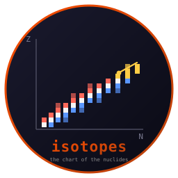
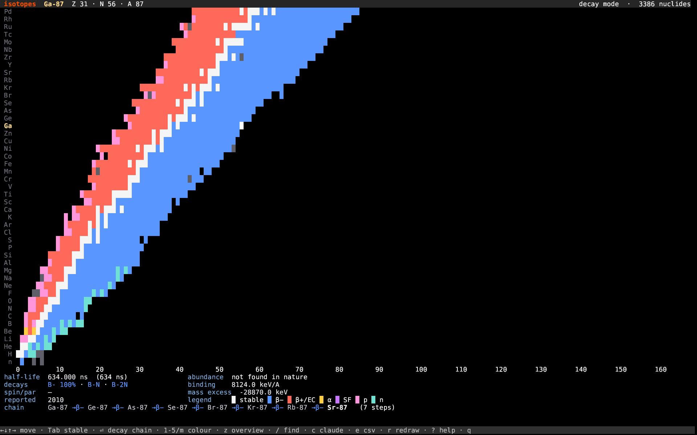

# isotopes



**The chart of the nuclides in your terminal. Written in Rust.**

   [](https://github.com/isene/fe2o3)

Neutrons run across, protons up, one cell per nuclide, 3,386 of them. The
valley of stability is not drawn: it falls out of the data, the way the
main sequence falls out of a Hertzsprung-Russell diagram.

Press Enter on uranium-238 and follow it down fourteen steps to
lead-206, every half-life on the way.



## Features

- **3,386 nuclides** from the IAEA's evaluated ground-state table:
  half-lives, decay modes with their branchings, spin and parity,
  binding energy per nucleon, mass excess, natural abundance, and the
  year each was first reported
- **Walk it** with the arrow keys. Left and right run along one element's
  isotopes, skipping the gaps; up and down change element, keeping near
  the same neutron number. `Tab` hops to the next stable nuclide, which
  is a quick way to walk the valley floor
- **Decay chains** (`Enter`): follow the dominant mode down to something
  stable. U-238 lands on Pb-206 in fourteen steps, Th-232 on Pb-208 in
  ten. Fission and unknown modes end a chain honestly rather than
  guessing a daughter
- **Five colour modes** (1-5, or `m`): decay mode, half-life on a log
  scale over 26 decades, binding energy per nucleon (the iron peak is
  right there), natural abundance, and the year first reported, which
  fills the chart outward over a century
- **The whole chart at once** (`z`): all 3,386 in braille, eight nuclides
  per character, 90×30 cells
- **Find one** (`/`) the way you would say it: `U-238`, `fe56`, `14C`
- **Ask Claude** (`c`) about the nuclide you are looking at, with its
  numbers and decay chain as context
- **Export** (`e`) the whole table to `~/isotopes.csv`, ordered by the
  current colour mode
- **Offline and idle-free**: the table ships inside the binary, and the
  app blocks on a keypress like the rest of the suite

## Install

```bash
curl -L "https://github.com/isene/isotopes/releases/latest/download/isotopes-linux-x86_64" \
  -o ~/bin/isotopes && chmod +x ~/bin/isotopes
```

Or build it: `cargo build --release`. It needs
[crust](https://github.com/isene/crust) checked out beside it.

## Key bindings

| Key | Action |
|-----|--------|
| ← →, h l | Along one element's isotopes, skipping the gaps |
| ↑ ↓, k j | Up and down the elements, keeping near the same N |
| PgUp/PgDn, K J | Ten elements at a time |
| Tab, Shift+Tab | Next stable nuclide up / down the chart |
| Home / End | Lightest / heaviest isotope of this element |
| g / G | Hydrogen / the heaviest element |
| Enter | Follow the decay chain to its stable end |
| 1-5, m | Colour by decay mode, half-life, binding energy, abundance, year |
| z | The whole chart at once, in braille |
| / | Find a nuclide: `U-238`, `fe56`, `14C` |
| c | Ask Claude about this nuclide |
| e | Write the table to `~/isotopes.csv` |
| r | Redraw from scratch |
| ? | Help |
| q | Quit |

## CLI

```bash
isotopes            # opens on U-238
isotopes C-14       # or fe56, 14C, "U 235"
isotopes --help
```

## Where the numbers come from

The [IAEA Nuclear Data Section](https://www-nds.iaea.org/relnsd/vcharthtml/VChartHTML.html)
live chart API, ground states only, fetched once and compiled in. Their
evaluations rest on ENSDF and the Atomic Mass Evaluation.

Two things worth knowing about what you are looking at:

- **A chain follows the dominant mode only.** Bi-212 splits 64/36
  between β− and α, and this app takes the 64. The detail line shows
  every branch, so you can see where it forked.
- **Branchings below a hundredth of a percent read as "tiny"** rather
  than as twelve zeroes. U-234 really does emit magnesium-28, about once
  in ten trillion decays.

## Part of the Rust Terminal Suite (Fe₂O₃)

See the [Fe₂O₃ suite overview](https://github.com/isene/fe2o3) and the
[landing page](https://isene.org/fe2o3/). It sits next to
[elements](https://github.com/isene/elements) (the periodic table),
[stars](https://github.com/isene/stars) (the HR diagram) and
[particles](https://github.com/isene/particles) (the Standard Model).

## License

Public domain (Unlicense). Take it, fork it, or ignore it.

— [Geir Isene](https://isene.com)
